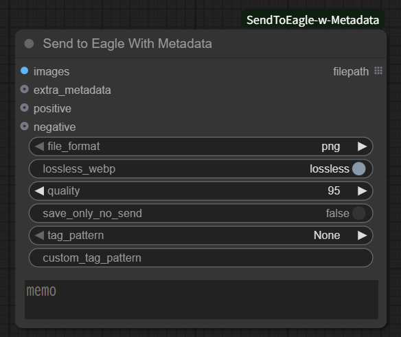
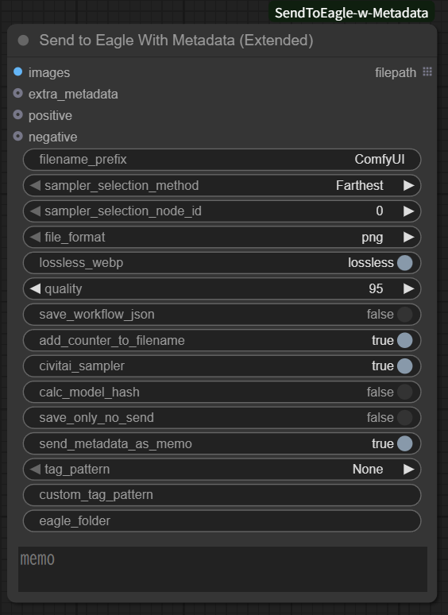

# ComfyUI-SendToEagle-w-Metadata

[<a href="README.md">English</a>] [日本語]

- [ComfyUI](https://github.com/comfyanonymous/ComfyUI) 用のカスタムノードです
- 各ノードの入力値から取得したメタデータ (PNGInfo) つきの画像を [Eagle](https://jp.eagle.cool/) (画像管理ソフト) に送信します
- 任意の `Key:Value` をメタデータに追加することもできます
- Eagleに登録するタグをカスタマイズすることができます
- Eagleのメモ欄に任意の文字列やメタデータを保存することができます

## インストール手順
```
cd <ComfyUIがあるディレクトリ>/custom_nodes
git clone https://github.com/watarika/ComfyUI-SendToEagle-w-Metadata.git
```

## カスタムノード一覧

 - Send to Eagle With Metadata
 - Send to Eagle With Metadata (Extended)
 - Create Extra MetaData

## Send to Eagle With Metadata
- 入力として受け取った `images` をメタデータ (PNGInfo) 付きの画像としてストレージに保存した後、Eagleに送信します
- 実際に付与されるメタデータの詳細は [画像に付与されるメタデータ](#metadata-detail) をご確認ください
- ファイル形式が `png` または `webp` の場合、ワークフローも画像に保存します<br>
※`webp` かつ `lossless` の場合、ワークフローの保存ができていない場合があります（調査中）



### 既定の動作

既定の動作は以下の通りです。<br>
これらの動作を変更したい場合は、`Send to Eagle With Metadata (Extended)` ノードを使用してください。

- ファイル名は `yyyyMMdd-hhmmss_SSSSSS` + `拡張子` の形式で保存されます
  - Batch sizeが2以上の場合は末尾に`(Batch index)`を付与し、バッチ実行した画像がユニークなファイル名を持つようにします
- Eagle のデフォルトフォルダに送信されます
- メタデータを Eagle のメモ欄にも保存します
- Sampler の名前を Civitai で使われている表記に変換します
  - 例：Samplerが `dpmpp_2m`、Schedulerが `karras` の場合 `DPM++ 2M Karras` となります
- モデルのハッシュ値はメタデータに出力しません
- 最初に処理された KSampler ノードからメタデータを取得します

### 指定可能な設定項目

|　項目　|　説明　|
| --------------------- | ------------------------------------- |
| file_format | 保存するファイルのフォーマットを指定します。`png`, `jpeg`, `webp` が指定できます |
| lossless_webp | `file_format` が `webp` の場合に画像を圧縮するかどうかを指定します<ul><li>`lossless` : 画像を圧縮せずに保存します</li><li>`lossy` : 画像を圧縮して保存します</li></ul> |
| quality | 画像を圧縮する際の品質を指定します。`0` から `100` の範囲で指定します。<br>※ jpeg または webp (lossy) の場合のみ有効です。 |
| save_only_no_send | `true` の場合、画像をストレージに保存するだけで Eagle には送信しません |
| tag_pattern | Eagle のタグに何を付与するかを指定します。<ul><li>`None` : タグを付与しません</li><li>`Positive Prompt` : Positive Prompt をタグとして付与します</li><li>`Positive Prompt, Negative Prompt` : Positive Prompt と Negative Prompt をタグとして付与します</li><li>`Memo` : `memo` の内容をタグとして付与します</li><li>`Custom` : `custom_tag_pattern` で指定した文字列をタグとして付与します</li></ul>※Negative Promptは登録時、タグ名の頭に `"n:"` をつけ、Positive Prompt のタグと判別できるようにします |
| custom_tag_pattern | `tag_pattern` が `Custom` の場合に使用するタグのパターンをカンマ区切りで指定します。<br>使用可能な設定は以下の通りです。<ul><li>画像メタデータ : `Positive prompt`, `Negative prompt`, `Steps`, `Sampler`, `CFG scale`, `Seed`, `Clip skip`, `Size`, `Model`, `Model hash`, `VAE`, `VAE hash`, `Batch index`, `Batch size`</li><li>メモの内容：`Memo`</li><li>追加メタデータ : `extra_metadata` で定義した `Key`</li></ul>※上記に当てはまらない項目はそのままタグとして付与されます<br>※値が取得できないメタデータは値に `-` を付与します（例 : `"Model hash: -"`） ||
| memo | Eagle のメモ欄に保存するテキストを指定します。指定したテキストはメモ欄の最後尾に `"Memo:"` を付与して保存します |
| extra_metadata | 保存する画像に独自のメタデータを追加できます。不要な場合は省略できます。<br>`Create Extra MetaData` ノードで追加するメタデータを指定します。 |
| positive / negative | ワークフローからプロンプトを自動取得せずに、明示的にプロンプトを指定するオプション入力です。自動的にプロンプトが取得できない場合や自分でプロンプトを指定したい場合、本入力を使用してください。 |

#### バッチ対応

memo, custom_tag_pattern, extra_metadata, positive, negative の各入力はバッチ画像に対応しています。  
各入力がリストの場合はバッチのインデックスに応じた要素を適用し、リストがバッチ数より短い分は空文字になります。単一の文字列を渡した場合は全画像に同じ文字列が適用されます。

### ノードの出力
- 保存した画像のファイルパスをフルパスで出力します（リスト形式）

## Send to Eagle With Metadata (Extended)
- 入力として受け取った `images` をメタデータ(PNGInfo)付きの画像としてストレージに保存した後、Eagleに送信します
- `Send to Eagle With Metadata` の既定の動作をカスタマイズできます
- 追加機能：ワークフローのJSONファイルをストレージに保存することができます



### 追加で指定可能な設定項目

- `Send to Eagle With Metadata` で指定できる設定項目に加えて以下の設定項目を指定できます

|　項目　|　説明　|
| --------------------- | ------------------------------------- |
| filename_prefix       | 保存するファイル名の先頭に付与する文字列を指定します。スラッシュ(/)で区切ることでディレクトリを指定することもできます。<br>`%<Key>%` を使用することで取得した情報に置換することができます。<br>※指定できる Key は[後述の表](#filename-prefix-key)を参照してください。 |
| sampler_selection_method | このノードより前に実行された KSampler ノードをどのように選択するかを指定します<ul><li>`Farthest` : このノードに最も遠い KSampler ノードを選びます</li><li>`Nearest` : このノードに最も近い KSampler ノードを選びます</li><li>`By node ID` : ノードIDが `sampler_selection_node_id` である KSampler ノードを選びます</li></ul> |
| sampler_selection_node_id | `sampler_selection_method` が `By node ID` の場合のみ指定します。<br>このノードより前に実行された KSampler ノードのノードIDを指定します。ノードIDはノードの右上に表示されている数字です。 |
| save_workflow_json | ワークフローのJSONファイルをストレージに保存するかどうかを指定します。<br>※Eagle には送信しません。 |
| add_counter_to_filename | ファイル名にカウンターを付与するかどうかを指定します。<ul><li>`true`: カウンター部分を除くファイル名が同一のファイル群で連番を付与します</li><li>`false` : カウンターを付与しません。ただし、Batch sizeが2以上の場合は、ファイル名の末尾に`(Batch index)`を付与し、バッチ実行した画像がユニークなファイル名を持つようにします</li></ul> |
| civitai_sampler | Sampler の名前を Civitai で使われている表記に変換します<br>例：Samplerが `dpmpp_2m`、Schedulerが `karras` の場合 `DPM++ 2M Karras` となります |
| calc_model_hash | `true` の場合、モデルのハッシュ値を算出してメタデータに追加します<br>※モデルのハッシュ値を算出する時間がかかります |
| send_metadata_as_memo  | <ul><li>`true` : メタデータを Eagle のメモ欄に保存します。`memo` の入力がある場合、その内容をメタデータの後に `"Memo:"` を付与して保存します</li><li>`false` : メタデータを Eagle のメモ欄に保存しません。Eagle のメモ欄には `memo` の内容のみ保存されます</li></ul> |
| eagle_folder | 	Eagle 上での画像保存先フォルダを、FolderID または Folder名で指定します |

#### バッチ対応

filename_prefix, eagle_folder の各入力はバッチ画像に対応しています。  
各入力がリストの場合はバッチのインデックスに応じた要素を適用し、リストがバッチ数より短い分は空文字になります。単一の文字列を渡した場合は全画像に同じ文字列が適用されます。

<a id="filename-prefix-key"></a>
### `filename_prefix`で指定できるKey

| Key                   | 置換先の情報               |
| --------------------- | -------------------------- |
| %seed%                | シード値                   |
| %width%               | 画像の幅                   |
| %height%              | 画像の高さ                 |
| %pprompt%             | Positive Prompt            |
| %pprompt:<文字数n>%   | Positive Promptの先頭n文字 |
| %nprompt%             | Negative Prompt            |
| %nprompt:<文字数n>%   | Negative Promptの先頭n文字 |
| %model%               | Checkpoint名               |
| %model:<文字数n>%     | Checkpoint名の先頭n文字    |
| %date%                | 生成日時(yyyyMMddhhmmss)   |
| %date:<フォーマット>% | 生成日時                   |

`%date:<フォーマット>%` の `<フォーマット>` で指定する識別子は以下の表を参照ください。

| 識別子 | 説明 |
| ------ | ---- |
| yyyy   | 年   |
| MM     | 月   |
| dd     | 日   |
| hh     | 時   |
| mm     | 分   |
| ss     | 秒   |


## Create Extra Metadata
- 保存する画像に追加するメタデータを指定します。


<a id="metadata-detail"></a>
## 画像に付与されるメタデータ

| 項目 | 説明 |
| --------------------- | ------------------------------------- |
| Positive prompt | ポジティブプロンプト |
| Negative prompt | ネガティブプロンプト |
| Steps | ステップ数 |
| Sampler | Sampler + Scheduler の名称 |
| CFG scale | CFGスケール |
| Seed | シード値 |
| Clip skip | Clip skip の値<br>※`CLIP Set Last Layer` ノードを使った場合のみ出力されます |
| Size | 画像の幅 × 画像の高さ |
| Model | Checkpoint 名 |
| Model hash | Checkpoint のハッシュ値<br>※`calc_model_hash` が `true` の場合のみ出力されます |
| VAE | VAE 名 |
| VAE hash | VAE のハッシュ値<br>※`calc_model_hash` が `true` の場合のみ出力されます |
| Lora_`n` Model name | `n`番目の LoRA 名 |
| Lora_`n` Model hash | `n`番目の LoRA のハッシュ値 |
| Lora_`n` Strength model | `n`番目の LoRA の Model に対する strength 値 |
| Lora_`n` Strength clip | `n`番目の LoRA の Clip に対する strength 値 |
| Embedding_`n` Name | `n`番目の Embedding 名 |
| Embedding_`n` Hash | `n`番目の Embedding のハッシュ値 |
| Batch index | バッチ処理のインデックス<br>※Batch size >= 2の場合のみ出力されます |
| Batch size | バッチサイズ<br>※Batch size >= 2の場合のみ出力されます  |
| Hashes | Model、Lora_`n`、Embedding_`n` のそれぞれのハッシュ値をカンマ区切りで出力します（[Civitai](https://civitai.com/)用）<br>※`calc_model_hash` が `true` の場合のみ出力されます |
| (追加メタデータ) | `extra_metadata` に入力された独自のメタデータ |

## 対応しているノード・拡張機能
- メタデータは `sampler_selection_method` で見つけた KSampler ノードの入力と以前に実行されたノードの入力から取得します
  - 対象となるKSamplerノードは [py/defs/samplers.py](py/defs/samplers.py) と [py/defs/ext/](py/defs/ext/) 配下のファイルの `SAMPLERS` のキーです
- 対応しているノードは以下のファイルをご確認ください。
  - [py/defs/captures.py](py/defs/captures.py)
  - [py/defs/samplers.py](py/defs/samplers.py)
- 対応している拡張機能は以下のディレクトリをご確認ください。
  - [py/defs/ext/](py/defs/ext/)

## 既知の問題
- ループで複数回の "CLIP Text Encode (Prompt)" 相当のノードを使用する場合、1回目のワークフロー実行は正しく動作しますが、2回目以降のワークフロー実行で "CLIP Text Encode (Prompt)" の入力に変化がなく "CLIP Text Encode (Prompt)" がキャッシュにより再実行されない場合、正しくプロンプトが取得できません（ループのすべてのプロンプトが1ループ目の値になってしまいます）。
- "CLIP Text Encode (Prompt)" の入力または上流の入力が前回の実行と異なるなど、"CLIP Text Encode (Prompt)" 相当のノードが再実行された場合は2回目以降のワークフロー実行でも正しく動作します。
- この動作は、ComfyUIのキャッシュ機構による動作のため、カスタムノード側での対応は困難です。
- 対応方法：ノードの入力の positive/negative に明示的に値を入力するようにしてください

## 変更履歴
- 2025/11/02 1.1.4 ワークフローによってはエラーになるバグを修正
- 2025/11/01 1.1.3 filename_prefix/custom_tag_pattern/eagle_folder/memo/extra_metadataの各入力にリストを渡すことでバッチの画像毎に異なる値を設定できるようにした
- 2025/10/29 1.1.2 ループにより複数回呼び出された場合にループごとの値を正しくメタデータに保存するように修正
- 2025/10/29 1.1.1 出力にfilepath(リスト)のサイズを追加
- 2025/10/29 1.1.0 positive/negative のリスト入力でバッチごとにプロンプトを設定できるよう対応
- 2025/10/28 1.0.6 パフォーマンス向上のためプレビューなしに変更
- 2025/10/27 1.0.5 EagleのAPI Tokenに対応(環境変数で指定)
- 2025/10/26 1.0.4 DynamicPrompt関係でエラーになるケースを修正
- 2025/08/22 1.0.3 Qwen-Imageでエラーになっていた問題を修正
- 2025/03/23 1.0.2 embeddingsを使うとエラーになっていた問題を修正
- 2025/02/07 1.0.1 comfyui-prompt-controlに対応
- 2025/01/04 1.0.0 初版

## 謝辞
  - メタデータ取得の実装は [ComfyUI-SaveImageWithMetaData](https://github.com/nkchocoai/ComfyUI-SaveImageWithMetaData) を流用しています
  - Eagle送信の実装は [D2 Send Eagle](https://github.com/da2el-ai/ComfyUI-d2-send-eagle) を流用しています
  - タグのカスタマイズ仕様は WebUI の拡張機能である [Eagle-pnginfo](https://github.com/bbc-mc/sdweb-eagle-pnginfo) を参考にしています
  - 素晴らしいプログラムを作成、公開してくださった nkchocoai様、だにえる様、bbc_mc様に感謝します
